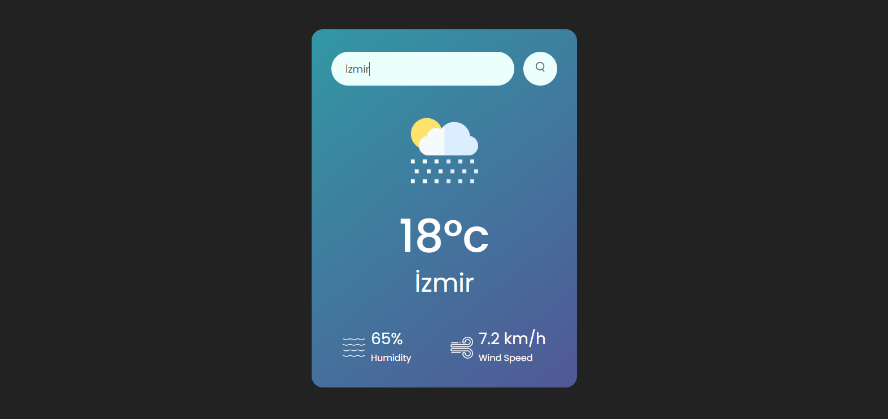

# Weather App

This is a simple weather application that allows users to check the current weather conditions for a specific city.

## Features

- Users can enter the name of a city to get its current weather conditions.
- The application displays the temperature, humidity, wind speed, and weather icon for the entered city.
- If the entered city is not found or there is an error, the application displays an error message.
- Users can search by pressing the search button or by pressing Enter after typing the city name.

## Technologies Used

- HTML
- CSS
- JavaScript
- OpenWeatherMap API

## Screenshots

 
 


## Live Demo

You can try the live demo of the Weather App [here](https://weather-app-sooty-nine-32.vercel.app/).


## How to Use

1. Clone the repository:

   ```bash
   git clone https://github.com/tugcanturunckapi/weather-app.git
   ```

2. Navigate to the project directory:

   ```bash
   cd weather-app
   ```

3. Open `index.html` in your web browser.

4. Enter the name of the city in the search box and press Enter or click the search button.

## Credits

This project is created by [Tuğcan](https://github.com/tugcanturunckapi).
